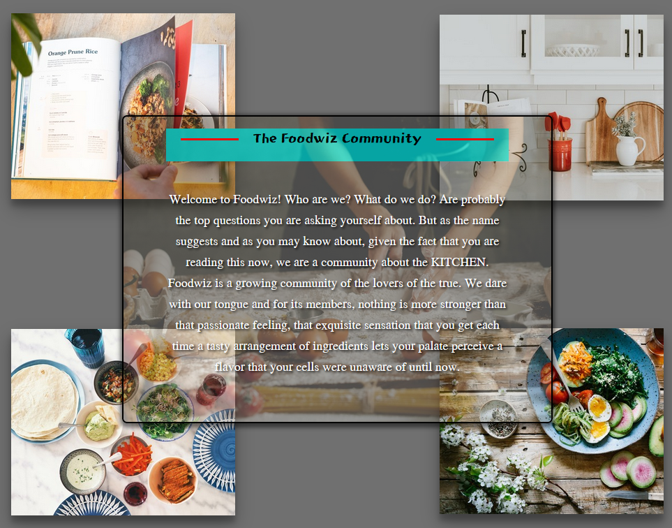

# Foodwiz !

***

Foodwiz is a recipe website dedicated to all culinary arts enthusiasts. Like most recipe sites, the author of foodwiz is himself a very active person, and even gifted without bragging, when it comes to taking the reins in the kitchen. It is his hope that this online platform will establish itself as a meeting place for those who want to share and learn; but more importantly, for the lovers of the kitchen.

## Getting Started

***

- [Planning material and concept for foodwiz](https://trello.com/b/5MsnhxDY/foodwiz)
# [Meet the Foodwiz community at its official website](https://foodwiz.fly.dev/)

Create recipes, share them with your friends, family, on your social medias, to the community. Foodwiz is also, but not only, a free access to a tremendous amount of recipes from diverse cultures around the world.

## Attributions

***

> ### Fonts:
 - All Fonts used in this project come from Google front

> ### Images and Layout:
 - The images were downloaded from [unsplash](https://unsplash.com/)
 - The design of the create recipe page is widely inspired by that of [All recipes](https://www.allrecipes.com/)

 > ### Other Features:
 - [WYSIWYG editor](https://www.tiny.cloud/) is the embedded editor I have in place of textarea

## Technologies Used

***

- Passport
- Google OAuth
- HTML
- CSS
- JavaScript
- Express
- MongoDB
- NodeJS

## Icebox - Next Steps

***

- [ ] Implement threads in comments
- [ ] Implement a follower/following tracking system
- [x] Implement rating features
- [ ] Implement search and filter features
- [x] Add text editor embedded within text field
- [ ] Add pictures to recipes
- [ ] Diversify type post, from pure recipes and blog-type posts
- [ ] Edit public profile
- [ ] Correcly associate comments to profiles and vice-versa

## Author

***

Jonathan Takam | [LinkedIn](www.linkedin.com/in/takam-jonathan).
